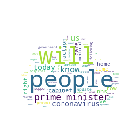
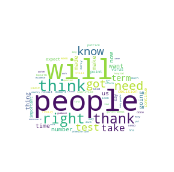

# Word Clouds from UK Government coronavirus Press Briefings

A collection of word clouds taken from the speeches given by UK Government ministers in the daily press briefings.

  
   

These word clouds are taken from transcripts of the opening speeches given by the ministers. The transcripts do not include:
* speeches given by government advisers
* the question-and-answer sessions involving the press
* any speeches at the end of the briefing.

## __Sources__
[7th April: Foreign Secretary Dominic Raab](https://www.gov.uk/government/speeches/foreign-secretarys-statement-on-coronavirus-covid-19-7-april-2020)

[8th April: Chancellor Rishi Sunak](https://www.facebook.com/itvnews/videos/1017549141973687/?__so__=serp_videos_tab)

[9th April: Foreign Secretary Dominic Raab](https://www.gov.uk/government/speeches/foreign-secretarys-statement-on-coronavirus-covid-19-9-april-2020)
