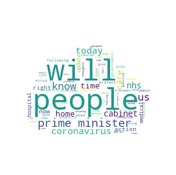
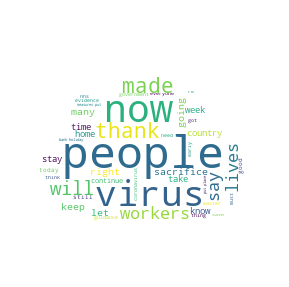

# Word Clouds from UK Government coronavirus Press Briefings

A collection of word clouds taken from the speeches given by UK Government ministers in the daily press briefings.

  
  
  

---

## Setup and Packages
The programs use:
* Python 3
* pip3 for installing packages
* wordcloud
* matplotlib
* numpy

---

## Methodology
The list of stopwords (words that are excluded from the clouds) is fairly short and is limited to common words such as `I`, `you`, `and` and `the`. It doesn't include verbs, adjectives or adverbs. This means that the clouds could include common words that do not impart much meaning, such as `very` or `really`.

The choice of speeches was determined by the availability of transcripts. Plus, due to time constraints, I limited myself to briefings from the past week. These choices mean that I only have texts from two people, Foreign Secretary Dominic Raab (two texts) and Chancellor Rishi Sunak (one text).

The transcripts do not include:
* speeches given by government advisers
* the question-and-answer sessions involving the press
* any speeches at the end of the briefing.
---

## Sources
__7th April: Foreign Secretary Dominic Raab__
[UK Government website](https://www.gov.uk/government/speeches/foreign-secretarys-statement-on-coronavirus-covid-19-7-april-2020)

__8th April: Chancellor Rishi Sunak__
[facebook](https://www.facebook.com/itvnews/videos/1017549141973687/?__so__=serp_videos_tab)

__9th April: Foreign Secretary Dominic Raab__
[UK Government website](https://www.gov.uk/government/speeches/foreign-secretarys-statement-on-coronavirus-covid-19-9-april-2020)

---

## Results
The most prominent word across the three speeches is `people`. This was a surprise to me. I had thought that terms about the virus would be more prominent.

Another prominent word is  `will`. I had a quick look at the texts, and the main use is as a modal verb. This suggests a focus on the future.

The lack of prominence of direct reference to medical matters was also a surprise. `Virus`, `coronavirus`, NHS` and `test` are there, but they are not dominant. That may be due to the fact that the speeches were by the Foreign Secretary and Chancellor, rather than the Health Secretary.

The inclusion of the word `ve` on 9th April was odd and I don't know why it appeared. `you've`, `we've`, `I've` and `they've` were in the list of excluded words, so these don't seem to be the reason, and I haven't found anything in the text to explain why `ve` was in the cloud. As a short-term fix, I add `ve` to the list of excluded words.

---

## Ideas for Further Research
* Gather a wider range of texts and speakers
* Rather than display data as word clouds, count the words.
* Explore different aspects of the results, such as:
  * levels of positivity
  * levels of certainty
  * the timeframes the texts use (past, present, future)
  * the extent to which the texts focus on people, processes, and objects
  * how the texts describe the virus and the emergency (for instance, war imagery)
  * differences between the speakers
  * how the texts change over time (for example, do they get more positive over time?)
  * use of pronouns (for example, `you` and `us`).
